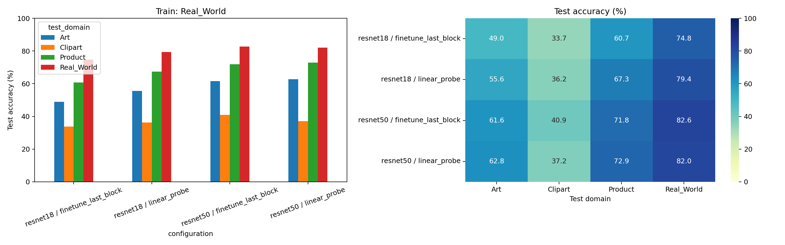
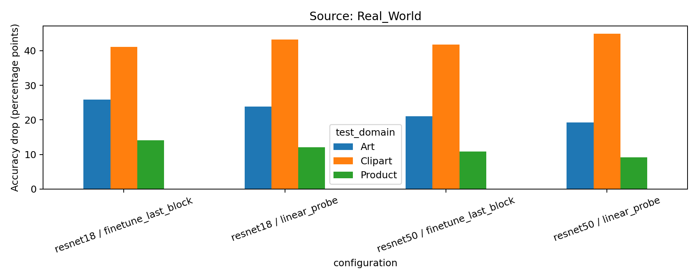

# Pretrained Vision Models Across Image Domains

Evaluate how ImageNet-pretrained ResNet18 and ResNet50 transfer from real-world photographs to product photographs, artistic depictions, and clipart. The experiment uses the 65 shared classes in Office-Home and compares a frozen backbone with fine-tuning of the final residual block.

## Experiment

- **Source domain:** Real-World. Only its training subset updates model parameters.
- **Model selection:** highest source-validation macro-F1, with early stopping after five epochs without improvement.
- **Test domains:** Real-World, Product, Art, and Clipart. Target training/validation subsets are unused.
- **Configurations:** two architectures × two training strategies = four runs.
- **Protocol:** custom source-only domain generalization with held-out partitions; not the standard Office-Home domain adaptation benchmark.

## Dataset

Office-Home is downloaded automatically from the public [Flower Labs mirror](https://huggingface.co/datasets/flwrlabs/office-home), pinned to revision `2a083645e3177afbd91ba4fa2651238f8994d335`. Archive downloads, authentication, and manual uploads are not required. Shard sizes and SHA-256 checksums are verified.

Validation found 15,588 images, no corrupted images, and 412 byte-identical duplicates. After deduplication, 15,176 images remain. Each domain/class is partitioned approximately 70/15/15 with split seed 2026. The same splits are used by all configurations.

| Domain | Train | Validation | Test |
|---|---:|---:|---:|
| Art | 1,617 | 349 | 349 |
| Clipart | 2,960 | 646 | 646 |
| Product | 2,985 | 646 | 646 |
| Real-World | 3,030 | 651 | 651 |

## Run on Colab

1. Open [the executed notebook](OfficeHome_DomainShift_Colab_T4.ipynb) in Google Colab, using **File → Upload notebook** or Colab's GitHub import.
2. Select **Runtime → Change runtime type → T4 GPU**.
3. Run the cells in order, or select **Run all**.

The notebook installs its additional dependencies and retains Colab's existing torch/torchvision installation. It downloads and caches the dataset, trains each configuration, evaluates all domains, and exports a compact results ZIP. A new run trains models unless matching local recovery checkpoints already exist.

Results and checkpoints are stored under `/content/OfficeHome_DomainShift_T4/`. The final ZIP excludes checkpoints. Runtime-local files are lost when the Colab runtime is deleted. The repository includes the completed metrics and predictions but no model checkpoints or dataset images.

If a DataLoader worker-cleanup warning appears and execution continues, it does not itself indicate a failed run. For a fresh run, set `NUM_WORKERS = 0` before executing the subsequent cells to use single-process loading. The recorded run used two workers. Worker count is included in the configuration fingerprint, so changing it and recreating the output configuration creates a separate run directory.

## Model checkpoints and large files

Supplementary files are available in the [Google Drive folder](https://drive.google.com/drive/folders/1BwltTDh_qRiF26FS5loaZozat-fKJAqY?usp=sharing). Use this folder to access model checkpoints and other large artifacts stored outside this repository.

For checkpoint archives, `best.pt` is intended for evaluation and inference, while `last.pt` stores the training state for resuming a run. Availability depends on the files uploaded to the folder.

## Training settings

| Setting | Value |
|---|---|
| Pretrained weights | `IMAGENET1K_V1` for both architectures |
| Input | 224 × 224, ImageNet normalization |
| Training augmentation | Random resized crop, scale 0.7–1.0; horizontal flip |
| Validation/test preprocessing | Resize shorter edge to 256; center crop to 224 |
| Linear probe | Train classification head only |
| Partial fine-tuning | Train `layer4` and classification head |
| BatchNorm | Running statistics fixed in both modes |
| Optimizer / loss | AdamW / cross-entropy |
| Head / block learning rate | 0.001 / 0.0001 |
| Weight decay | 0.0001 |
| Scheduler | Cosine annealing |
| Gradient clipping | Maximum norm 1.0 |
| Batch size | 32 |
| Maximum epochs | 15 linear probe; 20 partial fine-tuning |
| Training seed | 42 |
| Precision | Mixed precision, FP16 autocast |

## Test results

### Accuracy

| Model | Training strategy | Real-World | Product | Art | Clipart |
|---|---|---:|---:|---:|---:|
| resnet18 | Linear probe | 79.42% | 67.34% | 55.59% | 36.22% |
| resnet18 | Fine-tune last block | 74.81% | 60.68% | 49.00% | 33.75% |
| resnet50 | Linear probe | 82.03% | 72.91% | 62.75% | 37.15% |
| resnet50 | Fine-tune last block | 82.64% | 71.83% | 61.60% | 40.87% |

### Macro-F1

| Model | Training strategy | Real-World | Product | Art | Clipart |
|---|---|---:|---:|---:|---:|
| resnet18 | Linear probe | 0.7671 | 0.6550 | 0.5182 | 0.3345 |
| resnet18 | Fine-tune last block | 0.7230 | 0.5828 | 0.4423 | 0.3160 |
| resnet50 | Linear probe | 0.7954 | 0.7150 | 0.5898 | 0.3837 |
| resnet50 | Fine-tune last block | 0.8109 | 0.7042 | 0.5781 | 0.4372 |

Each table reports one seed on fixed test partitions. The full-precision values, selected epochs, sample counts, losses, and domain accuracy differences are in [results_all.csv](results/results_all.csv). Accuracy differences are measured in **percentage points**, not relative percentages. With one seed, the standard deviation columns in `summary.csv` are undefined (`NaN`).

### Findings

- ResNet50 has higher test accuracy than ResNet18 for both corresponding training strategies across all four domains.
- Clipart has the lowest test accuracy in every configuration. ResNet50 linear probe drops from 82.03% on Real-World to 37.15% on Clipart, a 44.88 percentage-point difference.
- ResNet18 fine-tuning lowers accuracy in every domain compared with its linear probe.
- ResNet50 fine-tuning improves Clipart accuracy by 3.72 percentage points and Real-World accuracy by 0.61 points, while reducing Art and Product accuracy by 1.15 and 1.08 points.
- These measurements do not establish the cause of the changes or statistical significance. Fine-tuning does not consistently improve cross-domain performance under this configuration.





## Verify the saved results without a GPU

Install `numpy`, `pandas`, and `scikit-learn`, then run from the repository root:

```bash
python scripts/verify_results.py
```

The script recomputes accuracy and macro-F1 from all 16 prediction files, checks class mappings, test-set membership, domain differences, validation-selected checkpoints, and dataset partitions. It does not train models or download data.

For a separate training environment, `requirements.txt` records the core PyTorch/torchvision pair observed in the completed run and the required additional packages. The observed CUDA build was `+cu130`; choose an appropriate CUDA wheel source for your machine. Installing the file does not provision a GPU or guarantee identical package versions for the unpinned auxiliary dependencies. Colab should use the notebook's own installation cell.

## Repository contents

- `OfficeHome_DomainShift_Colab_T4.ipynb`: executed notebook with tables and embedded figures; progress widgets and worker-cleanup tracebacks removed for readability.
- `results/`: original CSV/JSON outputs, split manifest, deduplication log, training histories, predictions, and per-class reports.
- `figures/`: original exported figures, including learning curves, domain examples, and ResNet18 linear-probe Clipart error analysis.
- `report/project_report.pdf` and `.tex`: English report with measured results, default LaTeX font, A4 pages, and 0.75 cm margins. Compile with `pdflatex project_report.tex` from `report/`.
- `scripts/verify_results.py`: independent checks of the archived results.
- `PROVENANCE.md`: input-file hashes and packaging changes.

## Limitations

The experiment uses one source domain, one seed, and one fixed data partition. Different domains also differ in image difficulty and composition, so accuracy differences do not isolate domain shift completely. Exact-byte deduplication does not detect near-duplicates, and overlap with ImageNet pretraining images cannot be ruled out. Only the last residual block is fine-tuned. No medical, satellite, or industrial dataset is evaluated. Results are not directly comparable to papers using the standard Office-Home adaptation protocol.

## References and data use

- Venkateswara, H., Eusebio, J., Chakraborty, S., & Panchanathan, S. (2017). *Deep Hashing Network for Unsupervised Domain Adaptation*. CVPR, 5018–5027. [Paper](https://openaccess.thecvf.com/content_cvpr_2017/html/Venkateswara_Deep_Hashing_Network_CVPR_2017_paper.html)
- [Original Office-Home website and fair-use notice](https://www.hemanthdv.org/officeHomeDataset.html)
- [Flower Labs dataset mirror](https://huggingface.co/datasets/flwrlabs/office-home)
- [Torchvision ResNet18](https://docs.pytorch.org/vision/stable/models/generated/torchvision.models.resnet18.html) and [ResNet50](https://docs.pytorch.org/vision/stable/models/generated/torchvision.models.resnet50.html)

Office-Home is provided under the authors' stated terms for noncommercial research and education. No dataset archive or pretrained weights are bundled. Third-party data and model weights retain their respective terms.
